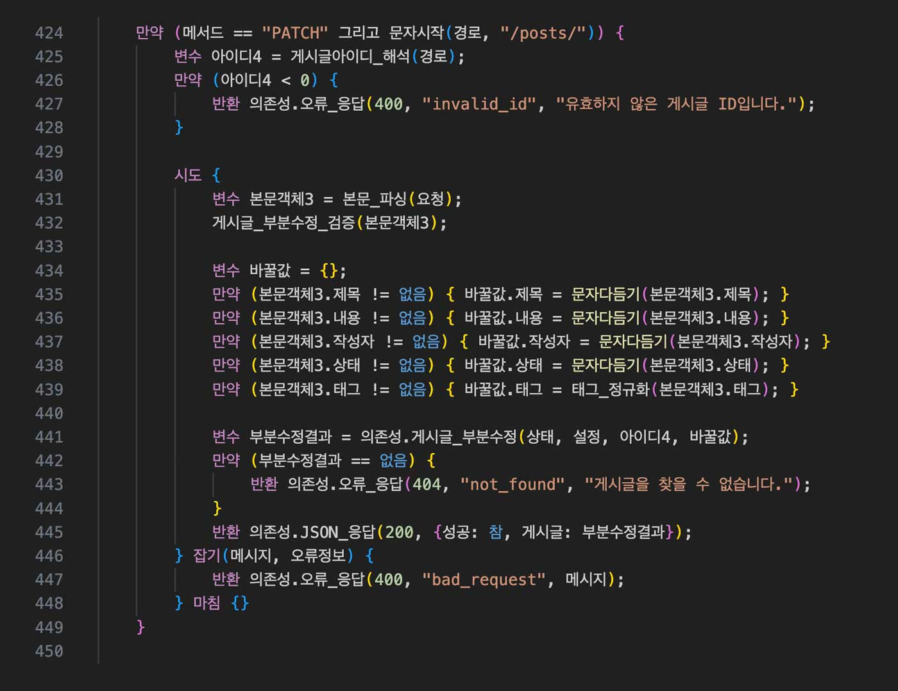

# COKAC Language

`cokaclang`은 한글로 이루어진 프로그래밍 언어입니다.
이 저장소는 Rust로 구현된 `cokaclang` 인터프리터와 관련 테스트/예제를 포함합니다.

## 저장소 구성

- `src/` : 런타임 구현
- `runtime/runtime_tests/` : 테스트 파일
- `runtime/runtime_tests_negative/` : 오류/실패 경로 테스트 파일
- `example/` : 예제 코드
- `example/projects/crud_board_backend/` : CRUD 게시판 예제
- `example/projects/crud_oop_board_backend/` : OOP 방식 CRUD 게시판 예제
- `tools/vscode-cokac-language/` : VSCode 문법 하이라이트 확장
- `COKAC_LANGUAGE_REFERENCE.md` : 언어 레퍼런스 문서
- `build.py`, `builder/` : 빌드 스크립트/도구

## 실행

CLI 사용법(`src/main.rs` 기준):

- `cokaclang <파일.cokac> [인수...]`
- `cokaclang --test <파일_또는_디렉토리> [...]`
- `cokaclang --test-json <파일_또는_디렉토리> [...]`

예시:

```bash
./dist/cokaclang-linux-aarch64 ./example/hello.cokac
./dist/cokaclang-linux-aarch64 --test runtime/runtime_tests
./dist/cokaclang-linux-aarch64 --test-json runtime/runtime_tests
```

## 빌드

빌드 스크립트:

```bash
python3 build.py
```

주요 옵션(`build.py` 기준):

- 모드: `--debug`, `--release`, `--clean`
- 타겟: `--native`, `--linux`, `--linux-arm64`, `--linux-x86_64`, `--macos`, `--macos-arm64`, `--macos-x86_64`, `--windows`, `--windows-x86_64`, `--windows-arm64`, `--all`
- 도구 설치/확인: `--setup`, `--setup-rust`, `--setup-cross`, `--setup-windows`, `--status`

타겟 동작(`builder/targets.py` 기준):

- 옵션을 주지 않으면 기본 타겟은 `native`
- `--all`은 Linux/macOS 타겟만 포함
- Windows까지 포함하려면 `--all --windows`

산출물(`builder/config.py`, `builder/executor.py` 기준):

- 출력 디렉토리: `dist/`
- 파일명 형식: `cokaclang-<friendly_name>`
  - 예: `cokaclang-linux-aarch64`, `cokaclang-macos-x86_64`, `cokaclang-windows-aarch64.exe`

## CRUD 게시판 예제

경로:

- `example/projects/crud_board_backend/`
- `example/projects/crud_oop_board_backend/`

이 예제의 현재 구현(`src/store.mod.cokac`)은 MySQL CLI(`mysql`)를 호출하는 방식입니다.

기본 실행:

```bash
./dist/cokaclang-linux-aarch64 ./example/projects/crud_board_backend/src/main.cokac
```

예제 상세는 다음 문서 참고:

- `example/projects/crud_board_backend/README.md`
- `example/projects/crud_oop_board_backend/README.md`

## VSCode 확장

경로:

- `tools/vscode-cokac-language/`

사용 가이드:

- `tools/vscode-cokac-language/USAGE_KO.md`
